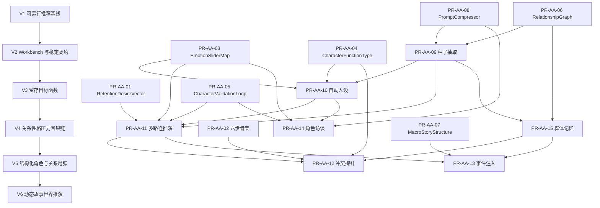

# alpha-autopilot V6 动态故事世界推演 PR 需求文档

## 1. 文档定位

- 日期：2026-04-28
- 目标版本：V6
- 阶段主题：动态故事世界推演（Dynamic Narrative Simulation）
- 对标参考：MiroFish 推演模块（https://github.com/666ghj/MiroFish）
- 上游基础：V1/V2 基线闭环、V3 留存目标函数、V4 人物关系驱动剧情、V5 结构化增强 PR-AA-01 至 PR-AA-08
- 输出目的：在完整承接 V1 至 V5 的基础上，形成 V6 可拆分、可评审、可验收、可落地的 PR 需求清单

V6 的核心目标不是“再加一个模拟按钮”，而是把 alpha-autopilot 从“静态章节推荐系统”推进为“可运行的故事世界推演系统”。

V1/V2 解决“推荐链路能不能稳定跑”；V3 解决“推荐是否更留人”；V4 解决“剧情为什么能从人物关系、性格和外部压力中自然长出来”；V5 进一步补齐留存欲望、人设参数、关系图、宏观结构和长上下文压缩。V6 要在这些基础上继续向前一步：

> 系统不仅能理解当前故事状态，还能把角色、关系、群体、记忆和留存目标放入一个可控模拟过程，推演多条后续路径，解释每条路径的风险与收益，并允许作者以“上帝视角”干预或直接访谈角色。

## 2. V1 至 V5 阶段能力复盘

### 2.1 V1：可运行章节推荐原型

V1 的价值在于建立最小可运行闭环：

- 训练样本读取；
- 初版特征矩阵训练；
- 章节推荐入口；
- 反馈更新接口；
- 示例数据集与基础脚本；
- rule/search/evaluation 的早期主链路雏形。

V1 的定位是稳定基线，不再承担新增复杂能力。对 V6 的意义是：V6 所有推演能力都不能破坏 V1 已有的可运行、可回放、可解释底座。

### 2.2 V2：Baseline 稳定化与 Workbench 化

V2 把 V1 原型推进为更稳定、更可扩展的工程形态，重点包括：

- `StoryState` 与推荐结果 schema 稳定；
- 推荐、预览、反馈流程前后端联通；
- 章节生成链路增强；
- 评估体系、版本对比、日志与回滚能力增强；
- V2 Workbench 成为后续阶段能力展示与人机协同入口。

V2 对 V6 的意义是：V6 不应另起一个孤立产品界面，而应复用 V2 Workbench 的状态组织、决策展示、预览对比和人工确认能力。V6 新增的“种子导入、角色参数化、多路径推演、事件注入、角色访谈”应渐进接入 Workbench，而不是替换 V2。

### 2.3 V3：读者留存目标函数与生成控制层

V3 明确了顶层目标函数：

> 在满足结构正确、风格一致、信息可控的前提下，最大化章节对读者的持续吸引力与继续阅读意愿。

V3 的关键能力包括：

- 留存目标函数；
- 生成控制层；
- 情绪推进、节奏推进、爽点密度、悬念保持、冲突增长、章节钩子等控制维度；
- rule/search/evaluation 主链路中的留存排序；
- 标签从“描述项”升级为“决策变量”。

V3 对 V6 的意义是：V6 的推演不是为了“模拟得热闹”，而是为了发现更有留存价值的后续路径。多路径推演的 winner 不能只靠生成模型主观判断，而必须接入 V3 的留存函数、评分维度和可解释排序逻辑。

### 2.4 V4：人物关系、性格、压力驱动剧情自然生成

V4 明确了小说生成的核心因果链：

> 剧情不是灵感瞎想出来的，也不是靠公式填出来的，而是从人物关系位移、人物性格选择和外部压力共同作用中自然长出来的。

V4 的关键能力包括：

- 人物关系抽象：地位差、信息差、情感差、利益冲突、控制/依赖、信任/背叛；
- 人物性格抽象：冲动/冷静、隐忍/直接、务实/理想化、强势/退让、自保/牺牲等；
- 外部压力抽象：断粮、威胁、羞辱、限时、利益争夺、生死压力、关系破裂；
- 多剧情候选生成；
- 接入 V3 留存排序；
- `v4_enabled` 总开关、降级、观测和生产门禁。

V4 对 V6 的意义是：V6 的模拟单元不能脱离“关系-性格-压力”因果链。每条推演路径都必须能解释：由什么关系触发、哪个性格维度导致角色选择、哪个外部压力推动爆发，以及为什么这条路径值得推荐。

### 2.5 V5：面向可模拟角色世界的结构化增强

V5 已完成 PR-AA-01 至 PR-AA-08，为 V6 提供直接底座：

| 编号 | V5 能力 | V6 中的作用 |
| --- | --- | --- |
| PR-AA-01 | RetentionDesireVector | 为每条推演路径提供留存欲望评分函数 |
| PR-AA-02 | 六步情节单元骨架 | 为推演结果提供章节级结构约束 |
| PR-AA-03 | EmotionSliderMap | 为角色模拟提供情绪/行为参数 |
| PR-AA-04 | CharacterFunctionType | 为角色功能位、伪装身份、冲突职责提供标签 |
| PR-AA-05 | CharacterValidationLoop | 为推演路径做角色一致性自校验 |
| PR-AA-06 | RelationshipGraph JSON | 为角色关系图、隐藏边、章节范围过滤提供输入格式 |
| PR-AA-07 | MacroStoryStructure | 为事件注入和路径推演提供宏观结构边界 |
| PR-AA-08 | PromptCompressor | 为长篇种子、角色记忆、访谈上下文做压缩注入 |

V5 解决的是“系统能理解哪些结构化约束”；V6 要解决的是“系统能否把这些结构化约束放进动态过程，并从过程中反向发现更优故事路径”。

## 3. V6 阶段总目标

V6 的阶段目标可以概括为：

> 从已有小说文本和 StoryState 中自动构建可运行故事世界，将角色、关系、记忆、群体、宏观结构和留存目标放入受控推演过程，输出多条后续剧情路径及其解释、评分、风险和可干预状态。

### 3.1 产品目标

V6 完成后，作者应能完成以下工作流：

1. 上传或选择已有章节文本；
2. 系统抽取角色、关系、事件、世界规则、张力点，形成 `NarrativeSeed`；
3. 系统将角色自动参数化为可运行的 `ParameterizedCharacterProfile`；
4. 系统在同一初始故事状态下并行推演 2 至 3 条后续路径；
5. 系统用 V3/V5 留存目标函数对路径排序，并解释 winner；
6. 作者可以查看每条路径的角色反应、关系变化、记忆变化、风险标记；
7. 作者可以注入突发事件并让系统重算路径；
8. 作者可以选择任意角色进行访谈，测试声线、动机和当前情绪；
9. 作者确认后，推演结果才进入 Story Bible、伏笔档案或章节生成链路。

### 3.2 工程目标

V6 必须保持阶段治理原则：

- 不破坏 V1/V2 基线推荐与 Workbench；
- 不绕开 V3 留存排序；
- 不推翻 V4 的关系-性格-压力因果链；
- 不重复发明 V5 已有结构；
- 所有 LLM 能力必须有 mock/deterministic fallback；
- 所有写入 Story Bible 的行为必须作者确认；
- 所有模拟路径必须可审计、可回放、可降级。

## 4. MiroFish 五阶段对标分析

### 4.1 Stage 1 图谱构建：已有 Story Bible/RelationshipGraph，但缺自动种子提取与群体记忆

MiroFish 的图谱构建包括：

1. 从种子材料提取实体、关系与事件；
2. 注入 GraphRAG 或图谱检索索引；
3. 分层注入个体记忆与群体记忆。

alpha-autopilot 已有 Story Bible、三元组、关系图、隐藏边和章节范围过滤，但仍有三类缺口：

- 原始章节文本到结构化种子的自动抽取不足；
- 图谱更多是“静态关系输入”，缺少对推演状态的增量记忆更新；
- 缺少群体/派系/组织层面的集体记忆。

V6 P0 不建议直接引入完整 GraphRAG 基础设施，因为这会把交付风险转移到索引、存储和检索调优上。V6 应优先完成“文本 → NarrativeSeed → RelationshipGraph/角色参数/群体记忆”的可运行管道。

对应 PR：PR-AA-09、PR-AA-15。

### 4.2 Stage 2 环境搭建：已有参数结构，但缺文本驱动的自动人设生成

MiroFish 会从种子文本自动生成可用于模拟的人物对象。alpha-autopilot V5 已有 EmotionSliderMap、CharacterFunctionType、MBTI/九型人格锚点和角色校验机制，但这些能力仍偏“结构已定义，用户或上游系统填入”。

V6 要补上的不是一个新字段，而是从章节文本和事件证据中自动推断角色参数的管道：

- 从行为事件推断情绪与行为基线；
- 从剧情职责推断 function_type；
- 从对白片段总结角色声线；
- 从已发生事件推断显性欲望、隐性欲望、恐惧和底线；
- 每项推断必须保留证据链和置信度。

对应 PR：PR-AA-10。

### 4.3 Stage 3 开始模拟：V6 最大增量，静态推荐升级为多路径推演

MiroFish 的核心价值在于同一初始状态下运行多条模拟轨道，并观察不同策略下的涌现结果。alpha-autopilot 当前已有多候选推荐和 V4 候选生成，但它们仍更接近“生成多个建议后排序”，而不是“每条路径拥有独立状态、独立记忆变化、独立角色反应链”。

V6 的 Stage 3 应拆成三类能力：

1. 多路径并行推演：同一初始 StoryState 下生成 2 至 3 条独立后续路径；
2. 涌现式冲突探针：在章节生成前让角色进行 K 轮轻量交互，发现自然冲突；
3. 事件注入与状态重算：作者可以中途注入世界事件，让系统重算路径排序。

对应 PR：PR-AA-11、PR-AA-12、PR-AA-13。

### 4.4 Stage 4 报告生成：Workbench 可承接，但需升级为模拟报告

V2 Workbench 已经有推荐解释、预览、风险提示和 decision 面板，天然可以承接 MiroFish ReportAgent 的一部分能力。但 V6 的报告不应只是“推荐理由”，而应包含完整推演审计：

- 每条路径的初始假设；
- 每轮角色反应；
- 关系变化；
- 记忆变化；
- 留存评分变化；
- 一致性风险；
- winner 选择原因；
- 作者可干预点。

对应 PR：PR-AA-11、PR-AA-13。

### 4.5 Stage 5 深度互动：新增角色访谈模式

MiroFish 支持与模拟世界中的角色直接对话。对小说创作而言，这对应“角色访谈”：作者可以测试角色声线、询问角色对某事件的真实反应、验证动机是否一致、生成对话素材。

alpha-autopilot 当前没有对应模块。V6 应新增角色访谈接口，但必须保持边界：访谈内容默认是创作素材，不自动成为正史，只有作者确认后才能写入 Story Bible 或伏笔档案。

对应 PR：PR-AA-14。

## 5. V6 PR 总览

| 编号 | 功能名称 | 优先级 | 核心目标 | 上游依赖 |
| --- | --- | --- | --- | --- |
| PR-AA-09 | 小说种子信息结构化提取器 | P0 | 从章节文本抽取可供推演的结构化种子 | V1/V2 StoryState、PR-AA-06、PR-AA-08 |
| PR-AA-10 | 文本驱动自动人设参数化 | P0 | 把文本角色转为可运行角色参数 | PR-AA-03、PR-AA-04、PR-AA-09 |
| PR-AA-11 | 多路径情节并行推演 | P0 | 同一初始状态下推演多条后续路径并排序 | PR-AA-01、PR-AA-05、PR-AA-09、PR-AA-10 |
| PR-AA-12 | 涌现式冲突探针 | P1 | 通过轻量角色交互发现自然冲突候选 | PR-AA-02、PR-AA-03、PR-AA-04、PR-AA-11 |
| PR-AA-13 | 上帝视角事件注入与重算 | P1 | 作者中途注入事件并触发路径重算 | PR-AA-07、PR-AA-11、PR-AA-12 |
| PR-AA-14 | 角色访谈接口 | P1 | 与指定角色对话，测试声线与动机 | PR-AA-03、PR-AA-05、PR-AA-10、PR-AA-08 |
| PR-AA-15 | 群体/派系记忆层 | P2 | 建立群体记忆并影响成员行为 | PR-AA-06、PR-AA-09、PR-AA-12、PR-AA-13 |

## 6. PR 详细需求

### 6.1 PR-AA-09：小说种子信息结构化提取器

#### 6.1.1 背景

V1/V2 的输入核心是 `StoryState`，但它更适合表达当前推荐所需状态，不适合从长篇原文中自动重建完整故事世界。V5 的 RelationshipGraph 已定义关系输入格式，但仍需要上游提供边。V6 必须新增 `NarrativeSeed`，作为“原始文本 → 结构化世界”的统一入口。

#### 6.1.2 输入

- 已有章节文本，支持单章或多章；
- 可选章节编号、标题、作者备注；
- 可选已有 Story Bible，用于增量合并；
- 可选抽取模式：`full` / `incremental` / `chapter_only`；
- 可选压缩策略，复用 PR-AA-08。

#### 6.1.3 输出

`NarrativeSeed` 至少包含：

- `characters`：角色、别名、首次出现章节、登场次数、证据片段；
- `relationship_triples`：主体、关系、客体、章节范围、显性/隐藏、置信度、证据句；
- `world_rules`：能力体系、地理边界、势力边界、禁忌规则、已生效设定；
- `plot_events`：关键事件、参与者、影响对象、章节范围、后果；
- `open_threads`：未解决问题、伏笔、悬念、待兑现承诺；
- `narrative_potential`：最高张力点、潜在爽点、潜在危机、可推演方向；
- `extraction_evidence`：字段级证据链；
- `needs_review`：低置信度或冲突字段列表。

#### 6.1.4 功能要求

1. 提供后端服务与 schema，不要求第一版完整 UI；
2. 支持 long text 分块抽取与合并；
3. 可输出 RelationshipGraph 兼容边；
4. 可输出 PR-AA-10 可消费的角色行为事件；
5. 每个关键字段必须有 `confidence` 或 `evidence`；
6. 低置信度结果默认不进入正式 Story Bible；
7. LLM extractor 必须可注入，默认测试使用 deterministic/mock extractor。

#### 6.1.5 验收标准

- 给定两章样例文本，能提取至少 2 个角色、1 条关系、1 个世界规则、1 个 plot event、1 个 open thread；
- `relationship_triples` 可转换为 PR-AA-06 RelationshipGraphInput；
- 低置信度字段进入 `needs_review`；
- 无真实 LLM 环境下测试可通过；
- 不破坏现有 V2 preview/state builder 流程。

#### 6.1.6 建议文件

- `backend/app/services/narrative_v6/schemas.py`
- `backend/app/services/narrative_v6/seed_extractor.py`
- `backend/app/api/routes/narrative_v6.py`
- `tests/test_narrative_seed_extractor.py`

### 6.2 PR-AA-10：文本驱动自动人设参数化

#### 6.2.1 背景

V5 已有 EmotionSliderMap 与 CharacterFunctionType，但这些结构只有在被填充后才有价值。V6 要让系统从文本证据中自动生成“可运行角色对象”，降低长篇群像小说中的手工维护成本。

#### 6.2.2 输入

- PR-AA-09 输出的 `NarrativeSeed`；
- 指定角色名或角色 ID；
- 可选章节范围；
- 可选作者校准项；
- 可选现有人设，用于增量修正。

#### 6.2.3 输出

`ParameterizedCharacterProfile` 至少包含：

- `character_id` / `name` / `aliases`；
- `emotion_slider_map`：兼容 PR-AA-03；
- `function_type`：兼容 PR-AA-04；
- `mbti_suggestion` 与可选 enneagram；
- `dialogue_style_summary`：句式、语气、常用词、禁忌表达；
- `desire_profile`：显性欲望、隐性欲望、恐惧、底线、当前目标；
- `behavior_triggers`：在何种压力下会攻击、退让、撒谎、牺牲或背叛；
- `evidence`：推断来源；
- `override_log`：作者覆盖记录。

#### 6.2.4 功能要求

1. 从角色行为事件反推 slider 基线；
2. 从剧情职责反推 function_type；
3. 从对白片段生成声线摘要；
4. 支持作者 override，且 override 优先于自动推断；
5. 输出置信度，避免无证据推断成为事实；
6. 与 PR-AA-05 CharacterValidationLoop 联动，为后续路径校验提供标准画像。

#### 6.2.5 验收标准

- 给定包含角色行为与对白的 `NarrativeSeed`，可生成合法 `ParameterizedCharacterProfile`；
- slider 值在 PR-AA-03 合法范围内；
- function_type 属于 PR-AA-04 枚举；
- 输出含 evidence；
- override 后保留来源并优先生效；
- 可被 PR-AA-11/14 直接消费。

#### 6.2.6 建议文件

- `backend/app/services/narrative_v6/character_parameterizer.py`
- `tests/test_character_parameterizer.py`

### 6.3 PR-AA-11：多路径情节并行推演

#### 6.3.1 背景

这是 V6 的核心 P0。当前系统可以生成候选、排序候选，但缺少“同一初始世界状态下，多条路径独立演化并横向比较”的能力。PR-AA-11 应把 V3 留存目标、V4 因果链和 V5 结构化角色全部放入一个可审计的模拟结果中。

#### 6.3.2 输入

- 当前 `StoryState`；
- `NarrativeSeed`；
- `ParameterizedCharacterProfile[]`；
- `RelationshipGraphInput`；
- 可选 `GroupMemoryGraph`；
- `RetentionDesireVector`；
- `MacroStoryStructure`；
- 路径数量，默认 3；
- 路径策略差异，例如“爽点优先、悬念优先、关系爆发优先”。

#### 6.3.3 输出

`ParallelPlotSimulationResult` 至少包含：

- `simulation_id`；
- `paths[]`；
- `path_id`；
- `initial_assumptions`；
- `plot_outline`；
- `six_step_scaffold_mapping`；
- `character_reactions`；
- `relationship_deltas`；
- `memory_deltas`；
- `retention_score` 与分项评分；
- `consistency_issues`；
- `risk_flags`；
- `recommendation_rank`；
- `winner_path_id`；
- `decision_summary`。

#### 6.3.4 功能要求

1. 同一输入下生成 2 至 3 条不同路径；
2. 每条路径使用独立 simulation state，不共享中间状态；
3. 每条路径必须包含 V4 因果解释：关系触发、性格选择、外部压力；
4. 每条路径必须接入 PR-AA-01 留存打分；
5. 每条路径必须接入 PR-AA-05 角色一致性校验；
6. 失败路径记录错误，不拖垮整次模拟；
7. winner 默认按 retention_score 排序，但 risk_flags 可影响最终推荐解释；
8. 输出可被 Workbench decision 面板消费。

#### 6.3.5 验收标准

- 固定 mock generator 下稳定输出 3 条路径；
- 每条路径有独立 path_id、评分、角色反应和关系变化；
- winner 等于最高可接受评分路径；
- 单路径失败不导致整体失败；
- decision_summary 可序列化给前端；
- 不绕开 V3 留存排序。

#### 6.3.6 建议文件

- `backend/app/services/narrative_v6/parallel_simulation.py`
- `backend/app/services/narrative_v6/scoring.py`
- `tests/test_parallel_plot_simulation.py`

### 6.4 PR-AA-12：涌现式冲突探针

#### 6.4.1 背景

六步骨架能保证结构完整，但不会自动告诉作者“这些角色最自然会爆发什么冲突”。PR-AA-12 用轻量 K 轮交互模拟，在不直接改写正文的前提下发现冲突候选、信息泄露和关系变化。

#### 6.4.2 输入

- N 个角色状态：EmotionSliderMap、function_type、desire_profile、当前记忆；
- RelationshipGraphInput；
- 可选 GroupMemory；
- 场景约束：地点、当前事件、禁止事项、章节阶段；
- 轮数 K，默认 3。

#### 6.4.3 输出

`EmergentConflictProbeResult` 至少包含：

- `interaction_rounds[]`；
- `conflict_candidates[]`；
- `information_leaks[]`；
- `relationship_changes[]`；
- `recommended_plot_hooks[]`；
- `six_step_binding_suggestions`；
- `risk_flags[]`。

#### 6.4.4 功能要求

1. 支持角色两两或小组交互；
2. 交互读取情绪、欲望、关系与群体记忆；
3. 输出冲突候选，不直接覆盖 StoryState；
4. 候选可绑定到 PR-AA-02 的六步字段；
5. 支持 deterministic probe 便于测试；
6. 与 PR-AA-11 联动，可把 conflict candidates 作为路径策略输入。

#### 6.4.5 验收标准

- 给定 3 个角色与关系图，输出至少 1 个冲突候选；
- K 轮交互日志完整；
- 冲突候选含触发角色、触发关系、触发性格、触发压力；
- 风险标记可展示；
- 未经作者确认不写入正式故事状态。

#### 6.4.6 建议文件

- `backend/app/services/narrative_v6/conflict_probe.py`
- `tests/test_emergent_conflict_probe.py`

### 6.5 PR-AA-13：上帝视角事件注入与重算

#### 6.5.1 背景

作者在创作中经常需要临时注入变量：宣战、死亡、天灾、背叛、误会、秘密曝光。V6 需要支持在模拟过程中暂停、注入事件、重算后续路径，而不是每次从零开始。

#### 6.5.2 输入

- `simulation_id` 或当前 `ParallelPlotSimulationResult`；
- 注入事件 `InjectedWorldEvent`；
- 事件类型、影响范围、涉及角色/势力、发生时间点、强制程度；
- 可选作者意图：必须保留主线目标、禁止角色死亡等；
- MacroStoryStructure 约束。

#### 6.5.3 输出

`EventInjectionResult` 至少包含：

- 更新后的路径；
- 角色反应变化；
- 关系与记忆变化；
- 新 retention_score；
- 排序变化；
- 宏观结构风险；
- 破坏性后果确认项；
- 注入审计日志。

#### 6.5.4 功能要求

1. 在推演循环中支持 `EventInjectionCheckpoint`；
2. 注入后从 checkpoint 继续，不丢弃前序状态；
3. 事件影响传播到角色、关系、群体记忆；
4. 受 PR-AA-07 宏观结构约束；
5. 记录前后评分与排序变化；
6. 第一版可只提供后端 API，不强制完整 UI。

#### 6.5.5 验收标准

- 给定 2 条路径和 1 个注入事件，系统能重算评分；
- 至少 1 个角色反应发生变化；
- 推荐排序可能变化，并解释原因；
- 违反宏观结构时输出 risk flag；
- 注入事件有审计日志。

#### 6.5.6 建议文件

- `backend/app/services/narrative_v6/event_injection.py`
- `tests/test_event_injection_checkpoint.py`

### 6.6 PR-AA-14：角色访谈接口

#### 6.6.1 背景

V6 的角色不应只存在于生成约束中，也应能被作者直接“访问”。角色访谈可以用于声线测试、动机验证、场景反应测试和对白素材生成。

#### 6.6.2 输入

- 角色 ID；
- `ParameterizedCharacterProfile`；
- 当前章节记忆；
- RelationshipGraphInput；
- 可选 GroupMemory；
- 用户消息；
- 访谈模式：`voice_test` / `scene_reaction` / `secret_probe` / `free_chat`；
- 安全边界：是否允许透露隐藏信息。

#### 6.6.3 输出

`CharacterInterviewResponse` 至少包含：

- 角色口吻回答；
- 使用的记忆依据；
- 情绪状态变化；
- OOC 风险标记；
- hidden info 泄露风险；
- transcript；
- 可选伏笔候选句。

#### 6.6.4 功能要求

1. 提供后端接口与 Workbench 面板最小入口；
2. system prompt 使用角色画像、记忆、情绪、关系、声线摘要；
3. 访谈内容默认不写入 Story Bible；
4. 写入伏笔档案或设定必须作者确认；
5. 与 PR-AA-05 联动检查 OOC；
6. 支持 mock responder 便于测试。

#### 6.6.5 验收标准

- 能选择角色并发起访谈；
- 回答体现角色声线；
- transcript 可导出；
- OOC 和泄密风险可标记；
- 默认不污染正式设定；
- 前后端契约至少有测试覆盖。

#### 6.6.6 建议文件

- `backend/app/services/narrative_v6/character_interview.py`
- `ui-react/src/features/v2Workbench/components/CharacterInterviewPanel.tsx`
- `tests/test_character_interview.py`

### 6.7 PR-AA-15：群体/派系记忆层

#### 6.7.1 背景

长篇小说中，角色不只受个体记忆影响，也受门派、家族、公司、王国、宗教、帮派等群体记忆影响。例如一个帮派遭遇背叛后，全体成员对外人警惕提升。V6 需要在 RelationshipGraph 上扩展群体记忆，但不应让群体记忆无边界污染所有成员。

#### 6.7.2 输入

- 群体/派系定义；
- 成员列表与成员角色；
- 群体记忆事件；
- 影响维度：trust、alertness、hostility、loyalty 等；
- 章节范围、hidden 标记、传播强度。

#### 6.7.3 输出

`GroupMemoryGraph` 至少包含：

- `groups[]`；
- `memberships[]`；
- `group_memories[]`；
- `behavior_effects[]`；
- `propagation_logs[]`；
- `reversible_patches[]`。

#### 6.7.4 功能要求

1. 在 PR-AA-06 RelationshipGraph 之上增加 GroupMemory 节点；
2. 群体事件可影响成员行为约束；
3. 支持章节范围过滤；
4. 支持 hidden group memory；
5. 支持传播强度与可撤销 patch；
6. 与 PR-AA-12/13 联动，参与冲突探针和事件注入。

#### 6.7.5 验收标准

- 给定一个群体和两个成员，群体记忆可影响成员行为约束；
- chapter_range 生效；
- hidden memory 默认不暴露；
- 输出 propagation log；
- 与 RelationshipGraph schema 向后兼容。

#### 6.7.6 建议文件

- `backend/app/services/narrative_v6/group_memory.py`
- `tests/test_group_memory_layer.py`

## 7. 集成拓扑

## 8. 推荐开发顺序

### 8.1 第一批 P0：打通最小动态推演主链路

1. PR-AA-09 小说种子信息结构化提取器；
2. PR-AA-10 文本驱动自动人设参数化；
3. PR-AA-11 多路径情节并行推演。

完成后应具备最小 V6 闭环：

> 章节文本 → NarrativeSeed → ParameterizedCharacterProfile → 3 条路径推演 → Retention winner → Workbench decision summary。

### 8.2 第二批 P1：增强涌现与作者控制

4. PR-AA-12 涌现式冲突探针；
5. PR-AA-13 上帝视角事件注入与重算；
6. PR-AA-14 角色访谈接口。

完成后 V6 从“自动推演”升级为“交互式推演”：作者既能看路径，也能试冲突、插事件、问角色。

### 8.3 第三批 P2：补足群体世界观扩展

7. PR-AA-15 群体/派系记忆层。

PR-AA-15 可在 V6 后段或 V6.1 深化，但 schema 应在 P0/P1 设计时预留，避免后续重构。

## 9. API 与数据契约建议

### 9.1 后端模块命名

建议新增 `backend/app/services/narrative_v6/`，避免继续把模拟运行时塞入 V2 或 V4 命名空间。

建议结构：

- `schemas.py`：V6 统一数据契约；
- `seed_extractor.py`：PR-AA-09；
- `character_parameterizer.py`：PR-AA-10；
- `parallel_simulation.py`：PR-AA-11；
- `conflict_probe.py`：PR-AA-12；
- `event_injection.py`：PR-AA-13；
- `character_interview.py`：PR-AA-14；
- `group_memory.py`：PR-AA-15；
- `state_store.py`：simulation state 暂存、回放与审计。

### 9.2 API 建议

| Method | Path | 用途 | 对应 PR |
| --- | --- | --- | --- |
| POST | `/api/narrative/v6/seed/extract` | 从章节文本抽取 NarrativeSeed | PR-AA-09 |
| POST | `/api/narrative/v6/characters/parameterize` | 自动生成人设参数 | PR-AA-10 |
| POST | `/api/narrative/v6/simulations/parallel` | 多路径情节推演 | PR-AA-11 |
| GET | `/api/narrative/v6/simulations/{id}` | 查询推演状态与报告 | PR-AA-11 |
| POST | `/api/narrative/v6/conflicts/probe` | 涌现式冲突探针 | PR-AA-12 |
| POST | `/api/narrative/v6/simulations/{id}/inject-event` | 上帝视角事件注入 | PR-AA-13 |
| POST | `/api/narrative/v6/characters/{id}/interview` | 角色访谈 | PR-AA-14 |
| POST | `/api/narrative/v6/group-memory/apply` | 群体记忆传播 | PR-AA-15 |

### 9.3 Workbench UI 接入建议

V6 不建议重做 Workbench，而应在 V2 Workbench 上增加四个渐进入口：

1. “种子导入/结构化”入口；
2. “角色参数化”入口；
3. “多路径推演”入口；
4. “角色访谈”入口。

所有入口都应保持人工确认原则：抽取结果、推演 winner、访谈 transcript、事件注入结果都不能默认写入正式 Story Bible。

## 10. 测试与验收策略

### 10.1 单元测试优先

每条 PR 必须有不依赖真实 LLM 的 deterministic 测试路径。涉及 LLM 的 extractor/generator/responder/judge 都必须可注入，默认测试使用 mock。

### 10.2 推荐测试集合

新增 V6 测试：

- `tests/test_narrative_seed_extractor.py`
- `tests/test_character_parameterizer.py`
- `tests/test_parallel_plot_simulation.py`
- `tests/test_emergent_conflict_probe.py`
- `tests/test_event_injection_checkpoint.py`
- `tests/test_character_interview.py`
- `tests/test_group_memory_layer.py`

保留 V5 核心回归：

- `tests/test_retention_desire_vector.py`
- `tests/test_alpha_autopilot_v3_generation_control_desire.py`
- `tests/test_narrative_v2_preview_service.py`
- `tests/test_narrative_v2_macro_structure.py`
- `tests/test_emotion_slider_map.py`
- `tests/test_character_validation_loop.py`
- `tests/test_relationship_graph_input.py`
- `tests/test_prompt_compressor.py`
- `tests/test_alpha_autopilot_v4_modules.py`
- `backend/tests/test_narrative_v4_api.py`

### 10.3 生产验收门槛

V6 P0 合入门槛：

- 主链路可完成：章节文本 → NarrativeSeed → 角色参数化 → 3 条路径推演 → winner 推荐；
- 所有新增 schema 有测试；
- 所有 LLM 能力有 mock fallback；
- 单条路径失败不导致整体推演失败；
- Workbench 至少能消费 PR-AA-11 的 decision_summary；
- 不破坏 V1/V2/V3/V4/V5 回归测试；
- 不绕开 V3 留存排序；
- 不默认写入 Story Bible。

V6 完整验收门槛：

- P0/P1/P2 PR 全部具备 schema、单测、集成测试；
- 支持事件注入后重算；
- 支持角色访谈 transcript 导出；
- 支持群体记忆章节过滤与 hidden 过滤；
- 可观测字段覆盖 simulation_id、path_id、fallback_reason、risk_flags、winner_reason、latency_ms；
- 有灰度、降级和回滚方案。

## 11. 风险与边界

### 11.1 V6 不应把 GraphRAG 作为 P0 阻断项

GraphRAG 很重要，但 V6 P0 更需要先证明动态推演主链路成立。完整 GraphRAG 可作为 V6.1/V7 增强，否则容易把重点从“推演能力”转移到“检索基础设施”。

### 11.2 模拟必须是可控涌现

V6 的涌现必须受三个边界约束：

- 角色一致性：EmotionSliderMap + CharacterValidationLoop；
- 结构边界：六步骨架 + MacroStoryStructure；
- 留存边界：RetentionDesireVector。

没有边界的模拟可能有趣，但不能稳定服务章节生成。

### 11.3 访谈内容默认不是正史

角色访谈会产生大量灵感素材，但可能包含即兴设定或试探性回答。默认必须作为 transcript 存档，只有作者确认后才能写入正式设定。

### 11.4 群体记忆必须可解释、可撤销

GroupMemory 对成员行为的影响必须有范围、强度、章节过滤和传播日志。禁止无边界地永久覆盖所有成员状态。

### 11.5 路径 winner 不是唯一正确答案

多路径推演的 winner 是基于当前留存目标和约束下的推荐结果，不代表作者必须采用。Workbench 必须展示备选路径与 trade-off，而不是只给一个“正确答案”。

## 12. V6 里程碑

### Milestone V6-A：结构化输入闭环

- 完成 PR-AA-09；
- 完成 PR-AA-10；
- 可从章节文本生成角色参数；
- 可导出 RelationshipGraph 兼容输入。

### Milestone V6-B：多路径推演闭环

- 完成 PR-AA-11；
- 可生成 2 至 3 条独立路径；
- 可用 RetentionDesireVector 排序；
- Workbench 可展示 winner 与备选路径。

### Milestone V6-C：交互式推演增强

- 完成 PR-AA-12；
- 完成 PR-AA-13；
- 支持冲突候选与中途事件注入；
- 推演状态可随事件变化重算。

### Milestone V6-D：深度互动与群体记忆

- 完成 PR-AA-14；
- 完成 PR-AA-15；
- 支持角色访谈；
- 支持群体记忆对成员行为传播。

## 13. 一句话总结

V6 是 alpha-autopilot 从“章节推荐系统”升级为“动态故事世界推演系统”的阶段：它承接 V1/V2 的稳定基线、V3 的留存目标、V4 的剧情因果链和 V5 的结构化角色能力，通过 PR-AA-09 至 PR-AA-15 打通“文本种子 → 可运行角色世界 → 多路径推演 → 留存排序 → 作者干预 → 角色访谈 → 群体记忆”的完整链路。
